# HelpDesk Lite — Arquitetura do Sistema

**Disciplina:** AI Driven Development — Aula 1 (Prática: Criando a arquitetura de um sistema)
**Data:** 21/09/2026
**Autor:** _(preencher)_

---

## 1. Visão geral

Sistema web para abertura, triagem e acompanhamento de chamados internos (TI, Facilities, RH). Usuários abrem chamados, atendentes assumem e resolvem, administradores gerenciam categorias e usuários e acompanham indicadores.

**Escopo do MVP (próxima aula):** dados mockados em banco em memória, execução 100% local, sem autenticação real (login simulado por seleção de usuário).

---

## 2. Funcionalidades principais

| # | Funcionalidade | Descrição |
|---|---|---|
| F1 | Abrir chamado | Solicitante informa título, descrição, categoria e prioridade |
| F2 | Listar e filtrar chamados | Por status, prioridade, categoria e "meus chamados" |
| F3 | Assumir chamado | Atendente se torna responsável; status vai para `EM_ATENDIMENTO` |
| F4 | Alterar status | Transições controladas: `ABERTO → EM_ATENDIMENTO → RESOLVIDO → FECHADO` |
| F5 | Comentar no chamado | Linha do tempo de interações entre solicitante e atendente |
| F6 | Gerenciar categorias | CRUD de categorias com SLA em horas |
| F7 | Gerenciar usuários | CRUD de usuários e perfis |
| F8 | Dashboard | Totais por status, chamados fora do SLA, tempo médio de resolução |

---

## 3. Tipos de usuário e permissões

| Ação | Solicitante | Atendente | Admin |
|---|:---:|:---:|:---:|
| Abrir chamado | ✅ | ✅ | ✅ |
| Ver próprios chamados | ✅ | ✅ | ✅ |
| Ver todos os chamados | ❌ | ✅ | ✅ |
| Assumir chamado | ❌ | ✅ | ✅ |
| Alterar status (em atendimento / resolvido) | ❌ | ✅ (só os seus) | ✅ |
| Fechar chamado (confirmar resolução) | ✅ (só os seus) | ❌ | ✅ |
| Comentar | ✅ (só os seus) | ✅ | ✅ |
| Gerenciar categorias | ❌ | ❌ | ✅ |
| Gerenciar usuários | ❌ | ❌ | ✅ |
| Ver dashboard | ❌ | ✅ | ✅ |

---

## 4. Arquitetura

A arquitetura é apresentada em quatro níveis de zoom (modelo C4): contexto, containers, componentes e código. Depois, o caminho de uma requisição pelas camadas, as decisões arquiteturais com alternativas descartadas, a visão de implantação e os aspectos transversais.

### 4.1 Estilo arquitetural

**Monolito modular em camadas**, com dependência unidirecional: `web → service → domain ← repository`. O domínio não conhece a camada web nem a de persistência (as entidades carregam anotações JPA, mas nenhuma regra de negócio depende do Spring). Frontend e backend são desacoplados por contrato REST/JSON e vivem em processos separados.

| Nível | O que mostra | Diagrama |
|---|---|---|
| 1 — Contexto | Quem usa o sistema e com o que ele se integra | 4.2 |
| 2 — Containers | Processos executáveis e armazenamentos | 4.3 |
| 3 — Componentes | Módulos internos do backend e do frontend | 4.4 e 4.5 |
| 4 — Código | Estrutura de pacotes e pastas | 4.8 |

### 4.2 Nível 1 — Contexto

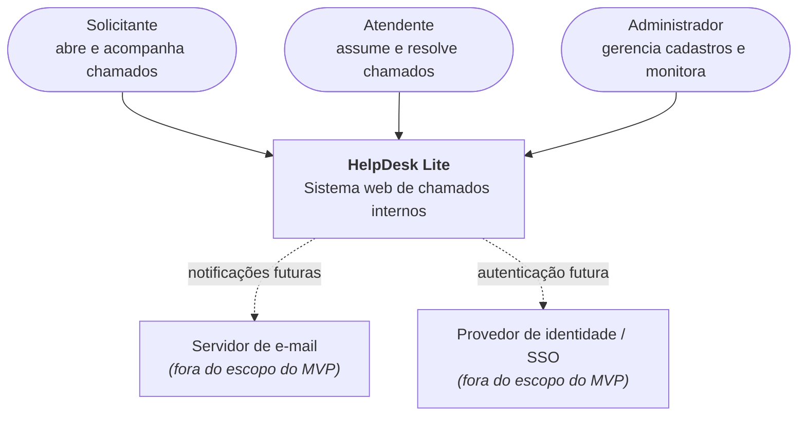

No MVP o sistema é autocontido: não há integrações externas. As linhas tracejadas marcam onde elas entrariam sem mudar o desenho interno.

### 4.3 Nível 2 — Containers

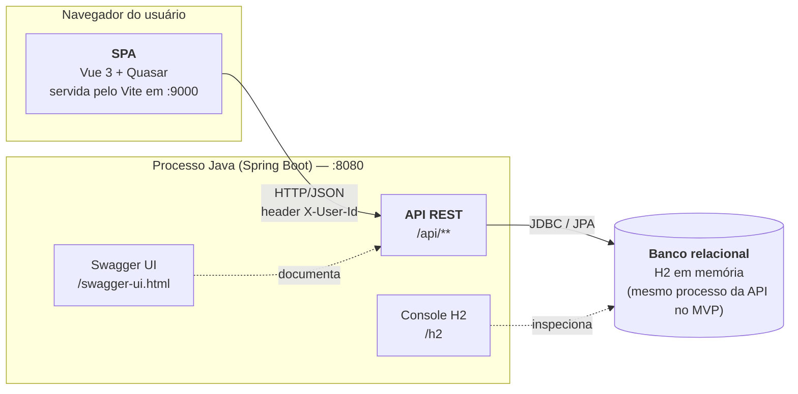

| Container | Tecnologia | Responsabilidade | Porta |
|---|---|---|---|
| SPA | Vue 3, Quasar, Pinia, Axios | Interface, navegação, estado de sessão, esconder ações sem permissão (só UX — a regra vale no backend) | 9000 |
| API REST | Spring Boot 3, Spring Web, Spring Data JPA | Regras de negócio, autorização, persistência, contrato da API | 8080 |
| Banco | H2 em memória (MVP) → PostgreSQL/SQL Server | Persistência relacional; seed via `data.sql` | embutido |
| Swagger UI | springdoc-openapi | Documentação viva e execução manual dos endpoints | 8080 |

### 4.4 Nível 3 — Componentes do backend

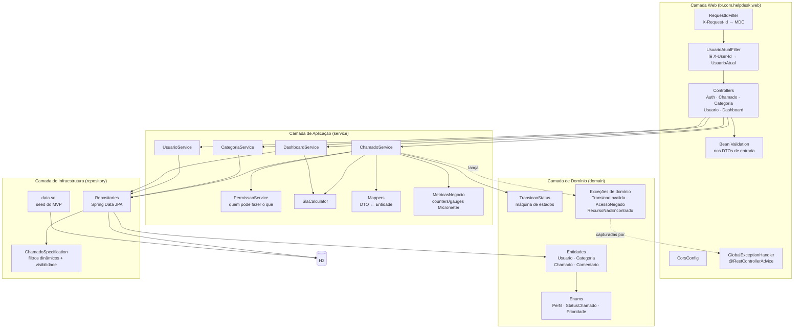

| Componente | Responsabilidade | Não faz |
|---|---|---|
| `RequestIdFilter` | Gera ou reaproveita `X-Request-Id`, coloca no MDC e devolve no header da resposta | Não sabe quem é o usuário |
| `UsuarioAtualFilter` | Lê `X-User-Id`, carrega o usuário, coloca `UsuarioAtual` no request e `usuarioId` no MDC; 401 se ausente/inválido/inativo | Não decide permissão |
| Controllers | Rotas, status HTTP, DTO de entrada/saída, delega para service | Nenhuma regra de negócio |
| `PermissaoService` | Traduz a tabela de permissões (seção 3) em código: perfil + relação com o chamado (é o solicitante? é o atendente?) | Não acessa banco |
| `TransicaoStatus` | Tabela de transições válidas e quem executa cada uma; único lugar que conhece a máquina de estados | Não sabe de HTTP |
| `ChamadoService` | Orquestra: busca → permissão → transição → persiste → mapeia | Não formata resposta HTTP |
| `ChamadoSpecification` | Monta a query dinâmica dos filtros e **injeta `solicitanteId = usuarioAtual` quando o perfil é SOLICITANTE** | — |
| `SlaCalculator` | Prazo, fora do SLA, tempo médio de resolução (regras da seção 8.3); recebe `Clock` injetado | Não acessa banco |
| `MetricasNegocio` | Encapsula os counters/gauges/timers da seção 4.11; único ponto que fala com o `MeterRegistry` | Não contém regra de negócio |
| `GlobalExceptionHandler` | Converte exceções em JSON padrão: validação → 400, `AcessoNegado` → 403, `RecursoNaoEncontrado` → 404, `TransicaoInvalida` → 422 | — |

### 4.5 Nível 3 — Componentes do frontend

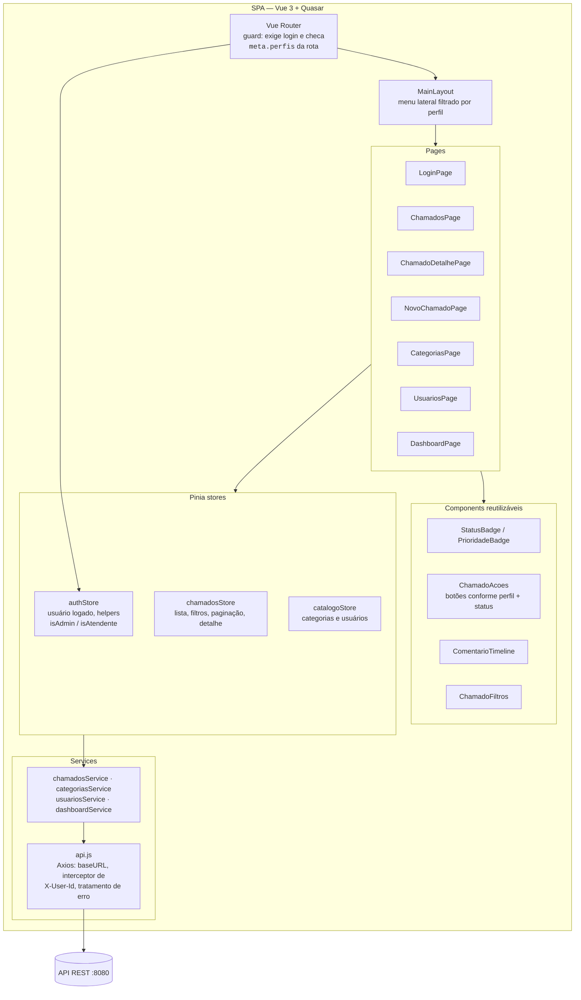

Regras de organização do frontend:

- **Pages** só montam tela e disparam ações da store; não chamam Axios direto.
- **Stores** guardam estado e chamam services; é onde fica a lógica de "recarregar lista após ação".
- **`api.js`** é o único ponto que conhece a URL do backend e o header `X-User-Id`; um interceptor de resposta converte o JSON de erro em `q-notify`.
- **Router guard** redireciona para login se `authStore` está vazio e para `/chamados` se o perfil não está em `meta.perfis`. Isso é UX: o backend continua validando tudo.

### 4.6 Caminho de uma requisição pelas camadas

Exemplo: atendente marca chamado como `RESOLVIDO`.

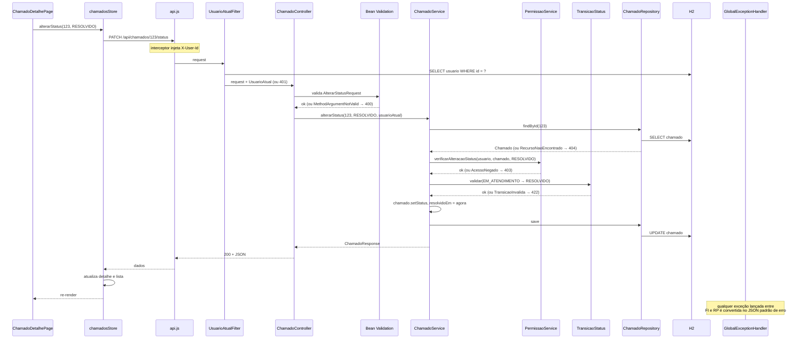

Pontos a observar:

1. **Duas verificações distintas e em ordem fixa:** primeiro *quem pode* (permissão, 403), depois *se pode agora* (transição, 422). Inverter a ordem vazaria informação sobre o estado do chamado para quem não deveria vê-lo.
2. **O controller não sabe o resultado da regra** — só repassa e traduz exceções via handler.
3. **A visibilidade do solicitante é aplicada na query**, não filtrando em memória: `ChamadoSpecification` adiciona `solicitante_id = :usuarioAtual` quando o perfil é `SOLICITANTE`, então nem a paginação nem o `count` vazam registros alheios.

### 4.7 Decisões arquiteturais (ADRs)

| ADR | Decisão | Alternativas consideradas | Por que essa |
|---|---|---|---|
| 001 | Monorepo com `backend/` e `frontend/` | Dois repositórios | Uma entrega, um clone, um vídeo. Separar só faz sentido com times ou pipelines distintos |
| 002 | Monolito em camadas | Arquitetura hexagonal / clean; microsserviços | 4 entidades e ~20 endpoints não justificam portas e adaptadores. Dependência unidirecional já dá o isolamento necessário |
| 003 | Autenticação simulada via header `X-User-Id` resolvido em um filter | Spring Security + JWT desde o início | Foco no domínio. O filter é o único ponto que conhece o mecanismo — trocar por JWT mexe em uma classe |
| 004 | Autorização em `PermissaoService` chamado pelo service | `@PreAuthorize` por método | Sem Spring Security no MVP; e as regras dependem da **relação** usuário–chamado (dono? atendente responsável?), não só do perfil — isso é regra de negócio, não de infraestrutura |
| 005 | Máquina de estados em `TransicaoStatus` (tabela `de → para → perfis`) | `if/else` no service; Spring StateMachine | Um lugar só, testável isoladamente, legível como tabela. Spring StateMachine é exagero |
| 006 | DTOs com mapeamento manual | MapStruct; expor entidade JPA | Poucas classes; evita lib e processador de anotações. Expor entidade acopla API ao banco e causa lazy-loading acidental |
| 007 | Filtros com JPA `Specification` | Métodos derivados (`findByStatusAndPrioridade...`); JPQL manual | Combinação de 4 filtros opcionais + regra de visibilidade explode em métodos derivados; `Specification` compõe |
| 008 | H2 em memória com `data.sql` | PostgreSQL via Docker | Zero setup, roda em qualquer máquina da apresentação. JPA abstrai a troca; `application-prod.yml` aponta para outro datasource |
| 009 | Soft delete (`ativo = false`) em usuário e categoria | Hard delete com cascata | Chamado histórico precisa continuar referenciando quem abriu e qual categoria |
| 010 | Erros como exceções de domínio + handler central | Retornar objeto `Result`/`Either` | Idiomático em Spring, menos ruído no service, mapeamento HTTP concentrado no handler |
| 011 | Listagens paginadas (`page`, `size`, `sort`) desde o MVP | Retornar lista completa | Custo zero com Spring Data `Pageable`; evita reescrever a tela depois |
| 012 | Observabilidade via Actuator + Micrometer + `X-Request-Id` no MDC | Só `System.out`/logs soltos; stack completa (Prometheus/Grafana/OTel) já no MVP | Actuator é uma dependência e zero código; dá health, métricas e correlação de logs. A stack externa pluga depois sem tocar no negócio |
| 013 | `Clock` injetável e `UsuarioAtual` por parâmetro | `Instant.now()` direto; `ThreadLocal`/`SecurityContextHolder` | Regras de SLA e permissão viram testes unitários puros; sem mock de contexto estático |

### 4.8 Nível 4 — Estrutura de código

```
helpdesk-lite/
├── .ai/                          # contexto para agentes (Aula 2)
├── docs/ARQUITETURA.md           # este documento
├── backend/
│   ├── pom.xml
│   └── src/main/java/br/com/helpdesk/
│       ├── HelpdeskApplication.java
│       ├── config/               # CorsConfig, OpenApiConfig, ClockConfig, MetricasConfig
│       ├── web/
│       │   ├── filter/           # RequestIdFilter, UsuarioAtualFilter, UsuarioAtual
│       │   ├── controller/       # AuthController, ChamadoController, ...
│       │   ├── dto/request/      # NovoChamadoRequest, AlterarStatusRequest, ...
│       │   ├── dto/response/     # ChamadoResponse, ChamadoResumoResponse, ...
│       │   └── exception/        # GlobalExceptionHandler, ErroResponse
│       ├── service/              # ChamadoService, PermissaoService, SlaCalculator, MetricasNegocio, mappers
│       ├── domain/
│       │   ├── model/            # Usuario, Categoria, Chamado, Comentario
│       │   ├── enums/            # Perfil, StatusChamado, Prioridade
│       │   ├── state/            # TransicaoStatus
│       │   └── exception/        # TransicaoInvalidaException, AcessoNegadoException, ...
│       └── repository/           # *Repository, ChamadoSpecification
│   ├── src/main/resources/
│   │   ├── application.yml       # perfil dev: H2, console, swagger, actuator aberto
│   │   ├── logback-spring.xml    # pattern com requestId e usuarioId (MDC)
│   │   └── data.sql              # seed
│   └── src/test/java/br/com/helpdesk/
│       ├── domain/               # TransicaoStatusTest, SlaCalculatorTest
│       ├── service/              # ChamadoServiceTest, PermissaoServiceTest
│       ├── web/                  # ChamadoControllerTest (@WebMvcTest)
│       ├── repository/           # ChamadoSpecificationTest (@DataJpaTest)
│       ├── integration/          # CicloDeVidaChamadoIT (@SpringBootTest)
│       └── support/              # builders e fixtures
└── frontend/
    ├── quasar.config.js
    └── src/
        ├── boot/axios.js
        ├── router/               # index.js, routes.js (meta.perfis por rota)
        ├── layouts/MainLayout.vue
        ├── pages/                # LoginPage, ChamadosPage, ChamadoDetalhePage, ...
        ├── components/           # StatusBadge, ChamadoAcoes, ComentarioTimeline, ChamadoFiltros
        ├── stores/               # auth.js, chamados.js, catalogo.js
        ├── services/             # api.js, chamados.js, categorias.js, usuarios.js, dashboard.js
        └── __tests__/            # Vitest: stores e components
```

### 4.9 Visão de implantação

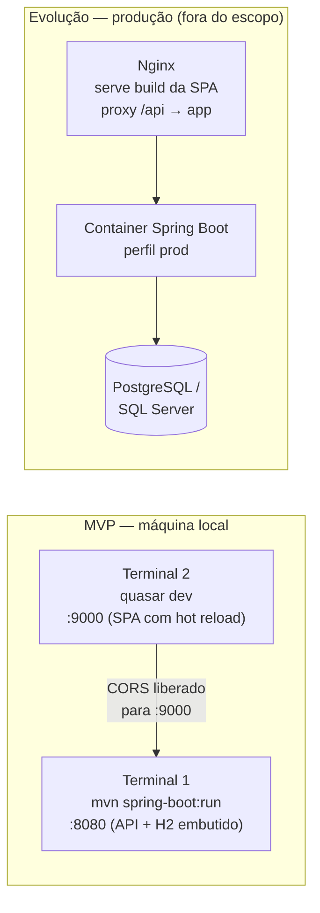

Em produção a SPA e a API ficam sob a mesma origem (Nginx faz proxy de `/api`), o que elimina o CORS. O `application-prod.yml` troca o datasource e desliga console H2 e Swagger.

### 4.10 Aspectos transversais e requisitos não funcionais

| Aspecto | Como é tratado |
|---|---|
| Validação de entrada | Bean Validation nos DTOs (`@NotBlank`, `@Size`, `@NotNull`); erro 400 com lista de campos inválidos |
| Tratamento de erros | Handler central; formato único de erro (seção 6); nenhum stack trace vaza para o cliente |
| Autorização | Sempre no backend (`PermissaoService` + `Specification`); frontend só esconde botões |
| CORS | Liberado apenas para `http://localhost:9000` no perfil dev |
| Paginação e ordenação | `Pageable` do Spring Data em todas as listagens; padrão `size=20`, `sort=criadoEm,desc` |
| Datas e fuso | Armazenadas em UTC (`Instant`), serializadas em ISO-8601, exibidas em `America/Sao_Paulo` no frontend |
| Documentação da API | OpenAPI gerada pelo springdoc a partir das anotações dos controllers e DTOs |
| Logs, métricas e health | Detalhado em 4.11: `RequestIdFilter` + MDC, Actuator/Micrometer com métricas de negócio, log de auditoria de transições |
| Configuração | `application.yml` por perfil (`dev`, `prod`); nada sensível versionado |
| Testes | Detalhado em 4.12: pirâmide unitário → slice → integração; regras de domínio testáveis sem Spring; `Clock` injetável |
| Performance | Índices em `chamado(status)`, `chamado(solicitante_id)`, `chamado(atendente_id)`; `fetch = LAZY` nas associações com `@EntityGraph` nas consultas de detalhe |
| Segurança (evolução) | Trocar `UsuarioAtualFilter` por autenticação JWT/SSO; `PermissaoService` permanece igual |

### 4.11 Observabilidade

Objetivo: em qualquer momento responder "o sistema está saudável?", "o que aconteceu com o chamado #123?" e "quantos chamados estão fora do SLA agora?" sem abrir o banco na mão. No MVP tudo roda no próprio processo (Actuator); a evolução pluga Prometheus/Grafana e tracing sem mudar código de negócio.

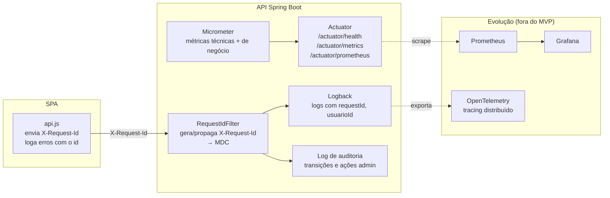

**Os três pilares no MVP**

| Pilar | Implementação | O que responde |
|---|---|---|
| **Logs** | SLF4J + Logback. `RequestIdFilter` cria ou reaproveita `X-Request-Id`, coloca `requestId` e `usuarioId` no MDC; o mesmo id volta no header da resposta e é exibido no `q-notify` de erro do frontend | "O usuário reclamou de um erro — qual foi?" Basta pedir o id que apareceu na tela e filtrar o log |
| **Métricas** | Spring Boot Actuator + Micrometer. Métricas técnicas prontas (latência e status por endpoint, JVM, pool JDBC) + métricas de negócio registradas no `ChamadoService` | "A API está lenta?", "Quantos chamados foram abertos hoje?", "Quantos estão fora do SLA agora?" |
| **Health** | `/actuator/health` com indicador do banco; usado como readiness em produção | "Posso mandar tráfego pra essa instância?" |
| **Tracing** (evolução) | OpenTelemetry via Micrometer Tracing; o `X-Request-Id` já existe como trace id de fato | "Onde o tempo foi gasto nessa requisição?" |

**Métricas de negócio expostas**

| Métrica | Tipo | Tags | Registrada em |
|---|---|---|---|
| `helpdesk_chamados_abertos_total` | Counter | `categoria`, `prioridade` | `ChamadoService.abrir` |
| `helpdesk_chamados_transicoes_total` | Counter | `de`, `para`, `perfil` | `ChamadoService.alterarStatus` / `assumir` |
| `helpdesk_chamados_por_status` | Gauge | `status` | Consulta agregada, atualizada a cada leitura |
| `helpdesk_chamados_fora_sla` | Gauge | — | `SlaCalculator` sobre chamados abertos/em atendimento |
| `helpdesk_tempo_resolucao_segundos` | Timer/Distribution | `categoria` | Ao entrar em `RESOLVIDO` (`resolvidoEm − criadoEm`) |

**Log de auditoria** — toda transição de status e toda ação administrativa (CRUD de usuário/categoria) gera uma linha `INFO` estruturada com: `requestId`, `usuarioId`, `perfil`, `acao`, `chamadoId`, `statusDe`, `statusPara`. Isso reconstrói a história de qualquer chamado sem tabela extra de auditoria no MVP (evolução: persistir em `chamado_evento`).

**Regras**

- Nenhum log em nível `INFO` ou acima contém dados pessoais além do id do usuário.
- `DEBUG` de SQL só no perfil `dev`.
- Actuator: em `dev` todos os endpoints abertos em `localhost`; em `prod` só `health` e `prometheus`, atrás da rede interna.
- Erros tratados pelo `GlobalExceptionHandler`: 4xx logados em `WARN` sem stack trace; 5xx em `ERROR` com stack trace.

### 4.12 Testabilidade

A arquitetura foi desenhada para que as regras mais importantes sejam testáveis **sem subir o Spring**. O que faz isso possível:

| Decisão de design | Efeito na testabilidade |
|---|---|
| `TransicaoStatus`, `SlaCalculator` e `PermissaoService` são classes puras (sem `@Autowired` de repositório, sem `HttpServletRequest`) | Testam-se com `new` e JUnit, em milissegundos |
| `UsuarioAtual` chega como **parâmetro** do service, não via `ThreadLocal`/`SecurityContext` | Teste do service monta o usuário na mão; sem mock de contexto |
| `Clock` injetado (`java.time.Clock`) em `SlaCalculator` e no `ChamadoService` | Testes de SLA e de `resolvidoEm` usam `Clock.fixed(...)`; nada de `Thread.sleep` ou datas "quase certas" |
| Repositórios são interfaces do Spring Data | Service testa com Mockito; a query real testa isolada com `@DataJpaTest` |
| `ChamadoSpecification` é uma classe separada | Teste de visibilidade do solicitante roda contra H2 real, não contra mock |
| Handler de erro centralizado | Um `@WebMvcTest` cobre o mapeamento exceção → HTTP para todos os controllers |
| `api.js` isolado no frontend | Stores testam com Axios mockado (`vi.mock`) |

**Pirâmide de testes**

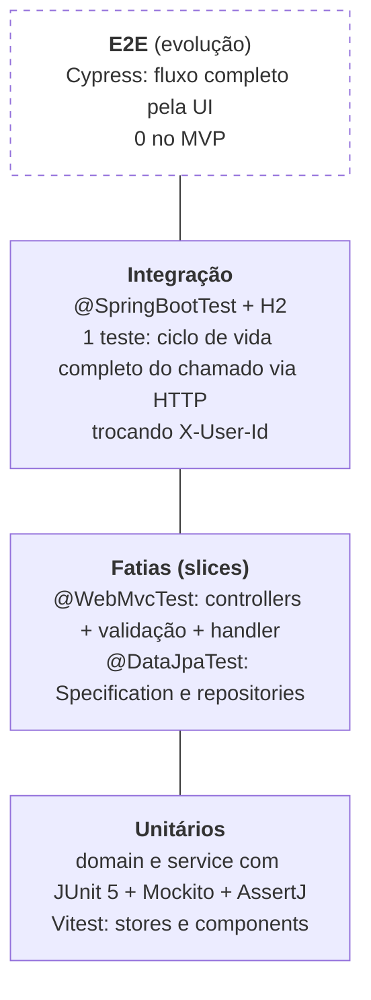

**O que cada nível cobre**

| Nível | Alvo | Casos obrigatórios no MVP |
|---|---|---|
| Unitário — domínio | `TransicaoStatus` | Todas as transições válidas; toda transição inválida lança `TransicaoInvalidaException`; reabertura só de `RESOLVIDO` |
| Unitário — domínio | `SlaCalculator` | Prazo correto; fora do SLA aberto vs resolvido tarde; tempo médio com zero, um e vários chamados |
| Unitário — service | `PermissaoService` | Cada linha da tabela da seção 3, incluindo os casos "só os seus" |
| Unitário — service | `ChamadoService` (repos mockados) | Assumir muda atendente e status; permissão é checada **antes** da transição; `resolvidoEm`/`fechadoEm` preenchidos com o `Clock` |
| Slice — web | `@WebMvcTest(ChamadoController)` | 400 em DTO inválido; 401 sem header; 403/404/422 mapeados a partir das exceções; JSON de erro no formato padrão |
| Slice — dados | `@DataJpaTest` | `ChamadoSpecification`: solicitante não vê chamados de outros nem no `count`; combinação de filtros |
| Integração | `@SpringBootTest` + `MockMvc` | Abrir → assumir → comentar → resolver → fechar com três usuários diferentes do seed |
| Frontend — unitário | `authStore`, `chamadosStore`, `ChamadoAcoes` | Helpers de perfil; recarrega lista após ação; botões exibidos conforme perfil + status |

**Convenções**

- Nome dos testes descreve regra, não método: `deveRejeitarTransicaoDeAbertoParaResolvido`, não `testAlterarStatus2`.
- Padrão *given/when/then* nos testes de service; fixtures via builders (`ChamadoBuilder.aberto().comSolicitante(...)`), nunca reaproveitando o `data.sql`.
- Testes de integração usam perfil `test` com H2 limpo (`@Transactional` faz rollback por teste).
- Cobertura mínima: 80% em `domain` e `service` (JaCoCo no `mvn verify`); controllers e frontend sem meta numérica no MVP.
- `mvn test` e `npm run test` são pré-requisito de todo commit de etapa (ver prompt de implementação).

---

## 5. Entidades principais e relacionamentos

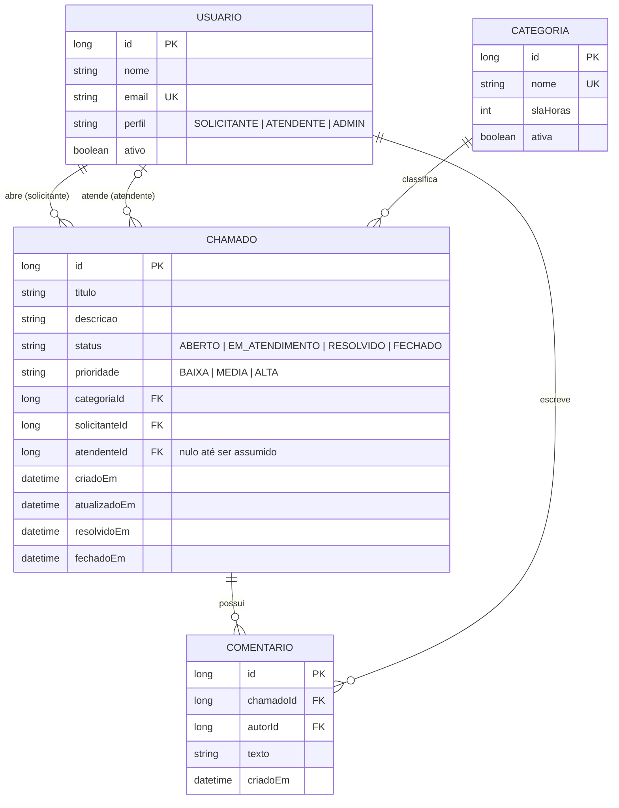

**Regras de integridade**

- Um chamado tem exatamente um solicitante e uma categoria; o atendente é opcional até ser assumido.
- Um chamado só pode ser assumido por usuário com perfil `ATENDENTE` ou `ADMIN`.
- Comentários são imutáveis após criação (sem edição/exclusão no MVP).
- Categoria não pode ser excluída se houver chamados vinculados — apenas desativada.

### Máquina de estados do chamado

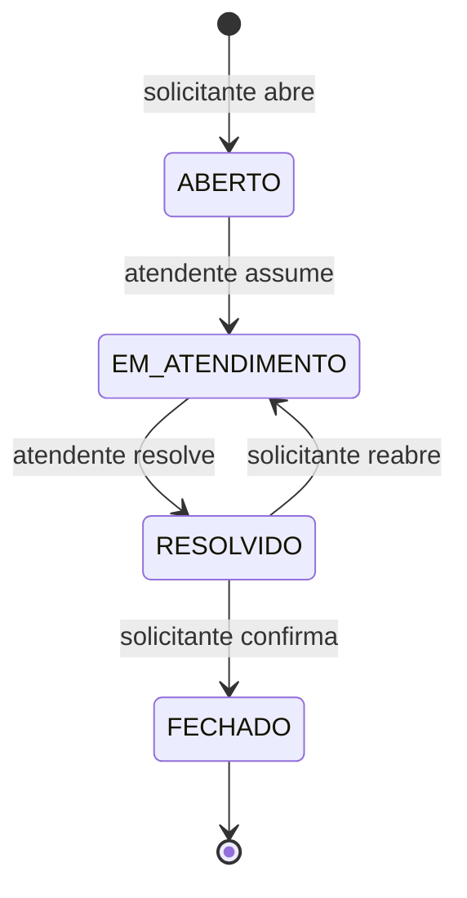

---

## 6. Endpoints da API

Base: `/api`. Todas as respostas em JSON. No MVP, o usuário logado é identificado pelo header `X-User-Id` (autenticação simulada). Listagens aceitam `page`, `size` e `sort` e retornam o envelope padrão do Spring Data (`content`, `totalElements`, `totalPages`, `number`).

### Autenticação (simulada)

| Método | Rota | Descrição | Perfil |
|---|---|---|---|
| GET | `/auth/usuarios-disponiveis` | Lista usuários para "login" na tela inicial | Público |
| POST | `/auth/login` | Recebe `usuarioId`, retorna dados do usuário | Público |

### Chamados

| Método | Rota | Descrição | Perfil |
|---|---|---|---|
| GET | `/chamados` | Lista paginada com filtros `status`, `prioridade`, `categoriaId`, `meus=true` | Todos (solicitante vê só os seus, aplicado na query) |
| GET | `/chamados/{id}` | Detalhe do chamado com comentários | Todos (solicitante só os seus) |
| POST | `/chamados` | Abre chamado | Todos |
| PATCH | `/chamados/{id}/assumir` | Atendente assume o chamado | Atendente, Admin |
| PATCH | `/chamados/{id}/status` | Body `{ "status": "RESOLVIDO" }` — valida transição | Conforme tabela de permissões |
| GET | `/chamados/{id}/comentarios` | Lista comentários | Todos com acesso ao chamado |
| POST | `/chamados/{id}/comentarios` | Adiciona comentário | Todos com acesso ao chamado |

### Categorias

| Método | Rota | Descrição | Perfil |
|---|---|---|---|
| GET | `/categorias` | Lista categorias ativas | Todos |
| POST | `/categorias` | Cria categoria | Admin |
| PUT | `/categorias/{id}` | Atualiza categoria | Admin |
| DELETE | `/categorias/{id}` | Desativa categoria (soft delete) | Admin |

### Usuários

| Método | Rota | Descrição | Perfil |
|---|---|---|---|
| GET | `/usuarios` | Lista usuários | Admin |
| POST | `/usuarios` | Cria usuário | Admin |
| PUT | `/usuarios/{id}` | Atualiza usuário | Admin |
| DELETE | `/usuarios/{id}` | Desativa usuário (soft delete) | Admin |

### Dashboard

| Método | Rota | Descrição | Perfil |
|---|---|---|---|
| GET | `/dashboard/resumo` | Totais por status, por prioridade, fora do SLA, tempo médio de resolução | Atendente, Admin |

**Padrão de erros**

```json
{ "timestamp": "2026-09-21T22:10:00", "status": 422, "erro": "TRANSICAO_INVALIDA", "mensagem": "Chamado ABERTO não pode ir direto para RESOLVIDO" }
```

Códigos usados: `200`, `201`, `204`, `400` (validação), `403` (sem permissão), `404`, `422` (regra de negócio).

---

## 7. Tecnologias sugeridas

| Camada | Genérico | Escolha para o MVP | Motivo |
|---|---|---|---|
| Frontend | Framework SPA + lib de componentes | Vue 3 + Vite + Quasar + Axios | Produtividade, componentes prontos (tabelas, forms, dialogs) |
| Backend | Framework web com ORM | Java 21 + Spring Boot 3 + Spring Data JPA + Bean Validation | Ecossistema maduro, stack conhecida pelo grupo |
| Banco | Banco relacional | H2 em memória (MVP) → PostgreSQL/SQL Server (produção) | Zero configuração local; seed via `data.sql` |
| Documentação da API | OpenAPI | springdoc-openapi (Swagger UI) | Facilita demonstração e testes no vídeo |
| Observabilidade | Health, métricas, logs correlacionados | Spring Boot Actuator + Micrometer + Logback (MDC) → Prometheus/Grafana na evolução | Zero código para health/métricas técnicas; métricas de negócio com poucas linhas |
| Testes backend | Framework de testes + mocks | JUnit 5, Mockito, AssertJ, Spring Test (`@WebMvcTest`, `@DataJpaTest`, `@SpringBootTest`), JaCoCo | Padrão do ecossistema, já vem no starter |
| Testes frontend | Runner de testes | Vitest + @vue/test-utils | Integrado ao Vite, roda rápido |
| Build | Gerenciador de dependências | Maven (backend), npm (frontend) | Padrão |
| Versionamento | Git | GitHub | Entregável da disciplina |

---

## 8. Fluxos principais

### 8.1 Ciclo de vida completo de um chamado

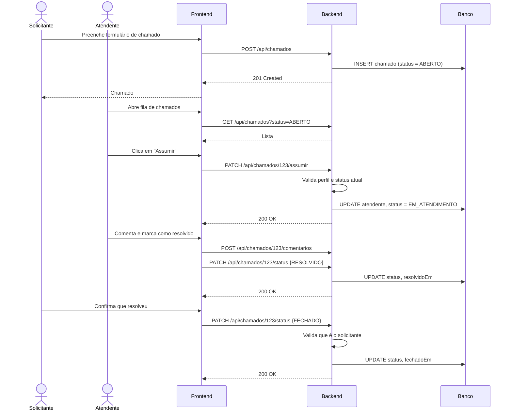

### 8.2 Login simulado (MVP)

1. Tela inicial lista usuários mockados (`GET /auth/usuarios-disponiveis`).
2. Usuário escolhe um, frontend chama `POST /auth/login` e guarda o retorno em memória (Pinia).
3. Toda requisição seguinte envia `X-User-Id`; o backend resolve perfil e aplica permissões.

### 8.3 Cálculo de SLA (dashboard)

- Prazo = `criadoEm + categoria.slaHoras`.
- Chamado está **fora do SLA** se `status ∈ {ABERTO, EM_ATENDIMENTO}` e `agora > prazo`, ou se `resolvidoEm > prazo`.
- Tempo médio de resolução = média de `resolvidoEm − criadoEm` dos chamados resolvidos/fechados.

---

## 9. Simplificações e limitações do MVP

As decisões arquiteturais com alternativas descartadas estão na seção 4.7. Aqui ficam só os cortes de escopo feitos para caber na próxima aula.

| Simplificação | Justificativa | Evolução futura |
|---|---|---|
| Autenticação simulada por `X-User-Id` | Foco no domínio; evita gastar a aula com segurança | Spring Security + JWT |
| H2 em memória com seed | Roda com `mvn spring-boot:run`, sem instalar nada | PostgreSQL/SQL Server via Docker |
| Sem upload de anexos | Complexidade fora do escopo | Storage de arquivos (S3/Blob) |
| Sem notificações | Idem | E-mail / websocket |
| Soft delete em usuários e categorias | Preserva histórico dos chamados | — |

---

## 10. Prompts utilizados para criar a arquitetura

**Ferramentas:** Claude (chat) para definição de escopo, entidades, endpoints e texto do documento; Mermaid (renderizado no GitHub) para os diagramas.

### Prompt 1 — definição do sistema

```
Preciso definir a arquitetura de um sistema simples para uma atividade acadêmica de
AI Driven Development. Requisitos da atividade: funcionalidades principais, tipos de
usuário e permissões, diagrama de arquitetura em camadas (frontend, backend, banco),
entidades e relacionamentos, endpoints REST, tecnologias sugeridas e fluxos principais.

O sistema será um HelpDesk interno (chamados de TI/Facilities). Deve ser simples o
suficiente para virar um MVP com dados mockados rodando localmente na próxima aula,
mas ter perfis distintos e um fluxo com estados para ficar interessante.

Stack de preferência: Java/Spring Boot no backend, Vue 3 no frontend, banco relacional.
Gere o documento completo em Markdown, com os diagramas em Mermaid.
```

### Prompt 2 — refinamento

```
Ajustes no documento:
- Adicione uma tabela de permissões cruzando ações x perfis (Solicitante, Atendente, Admin).
- Adicione um diagrama de estados (stateDiagram-v2) para o ciclo de vida do chamado,
  incluindo reabertura.
- Defina um padrão de resposta de erro e os códigos HTTP usados.
- Inclua uma seção de decisões do MVP explicando o que foi simplificado e por quê.
- Deixe explícito como o login simulado vai funcionar sem autenticação real.
```

### Prompt 3 — validação

```
Revise o documento procurando inconsistências: endpoints que não têm entidade
correspondente, permissões que contradizem os fluxos, campos do ER que não aparecem
em nenhum endpoint. Liste o que encontrar e corrija.
```

### Prompt 4 — aprofundamento da arquitetura

```
A seção de arquitetura ficou superficial: só um diagrama de três caixas. Reescreva-a
seguindo o modelo C4 (contexto, containers, componentes, código), com:
- diagrama de componentes do backend mostrando filter de autenticação, controllers,
  services, máquina de estados, serviço de permissão, repositories e exception handler;
- diagrama de componentes do frontend (router, layout, pages, stores, services);
- diagrama de sequência do caminho de uma requisição atravessando todas as camadas,
  incluindo onde cada tipo de erro (400/403/404/422) é gerado;
- tabela de ADRs com as alternativas consideradas e por que foram descartadas;
- estrutura de pacotes e pastas;
- visão de implantação (local vs produção);
- tabela de aspectos transversais (validação, erros, CORS, paginação, datas, logs,
  testes, performance).
Mantenha o restante do documento e ajuste referências cruzadas.
```

### Prompt 5 — observabilidade e testabilidade

```
Adicione à seção de arquitetura duas subseções para o documento ficar completo:
- Observabilidade: os três pilares (logs, métricas, tracing) no contexto do MVP, com
  correlação por request id, Actuator/Micrometer, métricas de negócio do domínio de
  chamados (nomes, tipo, tags), log de auditoria de transições e regras de privacidade
  nos logs. Deixe explícito o que é MVP e o que é evolução.
- Testabilidade: quais decisões de design tornam as regras testáveis sem subir o
  Spring (classes puras, Clock injetável, usuário por parâmetro), pirâmide de testes
  com os níveis usados, tabela de casos obrigatórios por nível e convenções.
Reflita isso nos componentes, na estrutura de código, nos ADRs e na tabela de
tecnologias.
```

---

## Navegação

- Entregável da Aula 2: `02_Prompt_Geracao_Contexto.md` e `03_Prompt_Implementacao.md`
